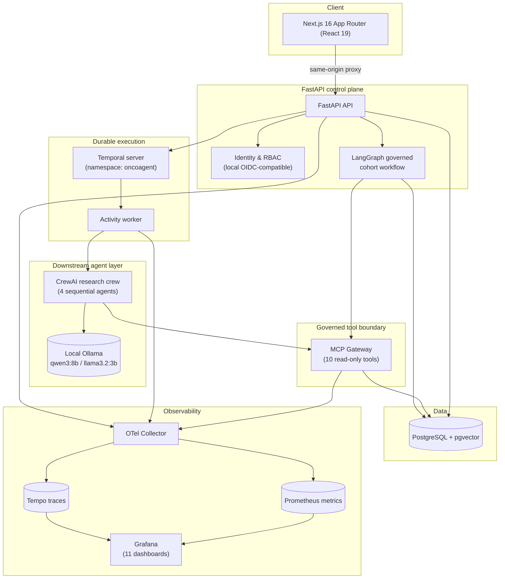
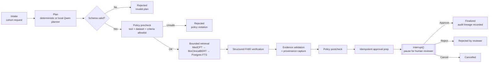
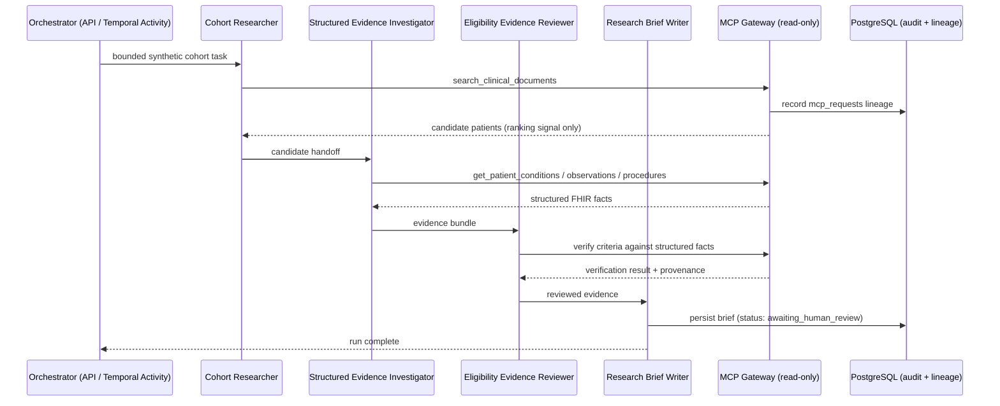
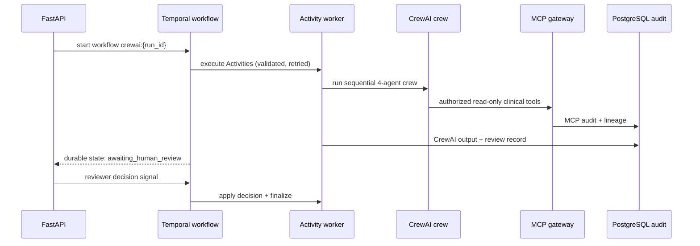
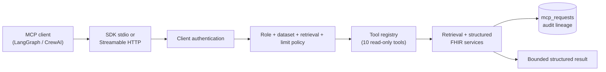
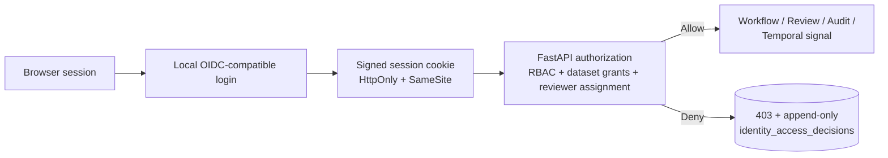

# OncoAgent Platform

**A governed, multi-framework agentic AI platform for synthetic oncology research workflows** — engineered to demonstrate the controls a regulated AI system actually needs in production: deterministic policy gates, mandatory human review, durable execution, cross-framework evaluation, full observability, and an append-only audit trail that survives a framework swap.

Two independent agent frameworks (LangGraph and CrewAI) are implemented, benchmarked head-to-head on identical scenarios, and constrained by the *same* non-negotiable boundary — a governed MCP tool gateway and a human-review gate — so the choice of framework never becomes a safety decision.

[](LICENSE)
[](apps/api/pyproject.toml)
[](apps/web/package.json)
[](https://github.com/GayanSamuditha/OncoAgent-Platform/actions/workflows/security.yml)

> **Scope note.** Every dataset is synthetic (Synthea-generated). This is a portfolio engineering project, not a medical device: nothing here is clinically validated, and no output should ever inform a real clinical decision. See [Disclaimers](#disclaimers--license).

---

## Table of contents

1. [Highlights](#highlights)
2. [Why this project exists](#why-this-project-exists)
3. [System architecture](#system-architecture)
4. [Governed multi-agent workflow — LangGraph](#governed-multi-agent-workflow--langgraph)
5. [Multi-framework agent communication](#multi-framework-agent-communication)
6. [Identity, governance & safety controls](#identity-governance--safety-controls)
7. [Observability & operations](#observability--operations)
8. [Resilience engineering](#resilience-engineering)
9. [Quality engineering & test coverage](#quality-engineering--test-coverage)
10. [Benchmarks & evaluations](#benchmarks--evaluations)
11. [Technology stack](#technology-stack)
12. [Repository layout](#repository-layout)
13. [Getting started](#getting-started)
14. [Roadmap](#roadmap)
15. [Disclaimers & license](#disclaimers--license)

---

## Highlights

| Capability | What was actually built |
| --- | --- |
| **Two governed agent frameworks** | A first-party LangGraph cohort workflow and a downstream CrewAI research crew, evaluated against the same 16-scenario suite rather than chosen by assumption |
| **Zero-trust tool access** | Every agent — LangGraph or CrewAI — reaches clinical data through one MCP gateway exposing 10 read-only, versioned tools. No agent holds a database session, FHIR repository, or filesystem handle |
| **Durable execution** | Temporal (`1.30.0` SDK / `1.31.2` server) coordinates the CrewAI lifecycle with typed, bounded retries and certified recovery across 16 fault scenarios |
| **Human-in-the-loop by construction** | Every workflow — either framework — stops at an approval interrupt or `awaiting_human_review`; no agent can approve its own output |
| **Identity & RBAC** | Local OIDC-compatible sessions, 6-role RBAC, synthetic dataset grants, reviewer separation-of-duties, and append-only SHA-256-chained access audit |
| **Full observability** | OpenTelemetry → Tempo/Prometheus → 11 Grafana dashboards, correlated with workflow, MCP, and Temporal lineage |
| **Versioned release gates** | A CLI-driven release-evaluation layer blocks unsafe, unprovenanced, or ungoverned candidates before they're considered "approved" |
| **Verified quality bar** | 163 backend tests, zero lint/type findings across Python and TypeScript, and a clean production build — reverified 2026-07-30 (see [Quality engineering](#quality-engineering--test-coverage)) |
| **100% synthetic data** | Every patient record traces back to a Synthea archive; the platform is explicitly and repeatedly labeled non-clinical |

---

## Why this project exists

Most agentic-AI demos stop at "an agent that calls an LLM and does something useful." Regulated domains — healthcare, finance, insurance — need more than that before an agent touches real data:

- **A decision made by a model is not a decision until a human approves it.** Every workflow here pauses for review; nothing self-finalizes.
- **Framework choice must not be a safety decision.** LangGraph and CrewAI are evaluated on identical scenarios and constrained by the same tool boundary and audit contract, so swapping frameworks doesn't change what's allowed.
- **Recovery must be provable, not assumed.** A durable orchestrator (Temporal) is certified against 16 concrete failure injections — worker crashes, transport failures, cancellations — with explicit recovery boundaries.
- **Audit has to survive the stack it's watching.** Telemetry (traces/metrics) is best-effort; the append-only, hash-chained access and lineage tables are the record of truth, independent of whether observability infrastructure is even running.

OncoAgent Platform builds all of that end to end — including the failure drills, the cross-framework benchmark, and the release gate that would block a regression — on synthetic oncology cohort research as the demonstration domain.

---

## System architecture



**Component responsibilities:**

| Layer | Owns | Does not own |
| --- | --- | --- |
| FastAPI | Authn/authz, workflow admission, evidence/audit persistence | Clinical tool access, model inference |
| LangGraph | Deterministic planning, structured FHIR verification, approval interrupts, PostgreSQL checkpoints | Durable retries across process restarts (that's Temporal's downstream slice) |
| Temporal | CrewAI lifecycle durability, typed retries, heartbeats, cancellation, review-wait | Clinical data access, governance policy |
| MCP Gateway | Tool authentication, dataset allowlists, retrieval policy, tool-call audit lineage | SQL, raw FHIR, filesystem, model selection, export, approval |
| CrewAI | 4-agent sequential research synthesis | Any direct data access — MCP-only |
| PostgreSQL | Application records, evidence, append-only audit, workflow checkpoints | — |
| Observability stack | Best-effort tracing/metrics for operational insight | Authorization, audit-of-record |

Docker Compose profiles compose the same services for different needs: the unprofiled **core** stack (Postgres, API, MCP, web), **temporal** (adds Temporal server/UI/worker), **observability** (adds Collector/Prometheus/Tempo/Grafana), and **full** (everything). See [`docs/deployment.md`](docs/deployment.md).

---

## Governed multi-agent workflow — LangGraph

The first-party workflow is a single persistent `StateGraph`, checkpointed in PostgreSQL, that treats semantic retrieval as *candidate generation only* — every inclusion criterion is re-verified against normalized structured FHIR facts before a human ever sees the case.



Key properties:

- The planner (deterministic, or optionally a localhost-only `qwen3:8b` via Ollama) can only emit a schema-validated `CohortPlan` referencing allowlisted criteria and tools — never SQL, shell, file paths, or arbitrary URLs. Invalid or unavailable local-model output falls back to the deterministic planner automatically, and the fallback reason is recorded.
- Retrieval similarity scores are **ranking signals, never clinical probabilities** — inclusion requires independent structured-fact verification.
- The reviewer who approves a run must be a *different* identity than the one who submitted it (separation of duties, enforced in [Identity & governance](#identity-governance--safety-controls)).
- A global `AGENT_EXECUTION_ENABLED=false` kill switch halts new execution instantly while inspection endpoints remain available.

---

## Multi-framework agent communication

### CrewAI research crew (downstream, MCP-only)

CrewAI is deliberately a **downstream consumer, not a control plane**. Its four sequential agents receive *only* thin, role-scoped MCP tool bindings — no agent is ever given a database session, FHIR repository, or model-configuration handle.



Memory and delegation are disabled, tool calls are bounded, and every successful brief is always `awaiting_human_review` — only a *different* reviewer/admin identity can move it forward.

### Durable orchestration via Temporal

Temporal owns lifecycle durability for the CrewAI path so recovery is a certified boundary, not a hope:



Transient failures (Ollama, MCP transport, PostgreSQL, worker interruption) get bounded, typed retries. Safety, authorization, dataset, and governance failures are **explicitly non-retryable** — a policy rejection never gets a second attempt. Recovery is always from the last completed Activity boundary, never a mid-generation token position.

### The MCP gateway — the one door into clinical data

Both frameworks reach data through the same governed boundary: an official Python MCP SDK server exposing exactly 10 versioned, read-only tools over Streamable HTTP and stdio.



No tool exposes SQL, shell, filesystem, raw-FHIR export, model selection, or audit mutation. Every call is authenticated to a server-configured client identity — an agent cannot claim a role or dataset through its own arguments — and is recorded with sanitized arguments, actor identity, correlation ID, latency, and retrieval-fallback lineage.

### Cross-framework governance, measured not assumed

Rather than asserting "LangGraph is better" or "CrewAI is better," the platform runs both through an identical 16-scenario suite and reports outcomes side by side — see [Benchmarks & evaluations](#benchmarks--evaluations). The selection policy that results (LangGraph for durable regulated operations, CrewAI for bounded downstream specialist synthesis) is a documented conclusion, not a default.

---

## Identity, governance & safety controls



- **Six RBAC roles**: `researcher`, `reviewer`, `governance_officer`, `platform_operator`, `auditor`, `administrator` — each with explicit permissions and synthetic dataset grants; roles are never accepted from browser-supplied fields.
- **Separation of duties**: a workflow's creator may inspect their own pending review, but only an *explicitly assigned*, dataset-authorized reviewer holding both `review:read-assigned` and `review:decide` may act on someone else's review.
- **MCP keeps its own identity boundary** — browser session cookies are never forwarded to MCP; it authenticates its own service clients independently.
- **Append-only, integrity-verified audit** — every access decision is persisted with a SHA-256 hash chain (`make audit-integrity-verify`); historical pre-chain records are marked `legacy_unverified` rather than silently backfilled.
- **Kill switches everywhere**: `AGENT_EXECUTION_ENABLED`, MCP's own enable flag, and Temporal admission checks all fail closed rather than degrading silently.
- **Retention is dry-run only**: `make retention-dry-run` prints the versioned retention policy; any real deletion requires an explicit bounded date range, an authorized actor, and its own audit record.

Full detail: [`docs/identity.md`](docs/identity.md), [`docs/governance.md`](docs/governance.md), [`docs/threat-model.md`](docs/threat-model.md).

---

## Observability & operations

`API / workers → OTLP → OpenTelemetry Collector → Tempo (traces) + Prometheus (metrics) → Grafana`. Telemetry is best-effort and low-cardinality by design — patient IDs, prompts, raw FHIR, credentials, and model reasoning are never metric labels or log fields. Trace IDs are correlated into workflow, CrewAI, and MCP audit rows, but they are correlation metadata, never the record of truth.

| Dashboard | Focus |
| --- | --- |
| `oncoagent-overview` | Platform-wide health at a glance |
| `oncoagent-langgraph` | Governed cohort workflow execution |
| `oncoagent-crewai` | CrewAI crew runs and stage timing |
| `oncoagent-mcp` | Tool-gateway request volume, latency, denials |
| `oncoagent-governance` | Policy decisions, approvals, rejections |
| `oncoagent-security` | Security-relevant events and denials |
| `oncoagent-reliability` | Temporal retries, recovery, and durability |
| `oncoagent-resilience` | Fault-injection scenario outcomes |
| `oncoagent-performance` | Bounded local load-profile results |
| `oncoagent-operations` | Infra-level service health |
| `oncoagent-models` | Local model (Ollama) execution telemetry |

| Endpoint | Purpose |
| --- | --- |
| `http://127.0.0.1:8000/metrics` | Prometheus scrape target |
| `http://127.0.0.1:9090` | Prometheus UI |
| `http://127.0.0.1:3200` | Tempo trace API |
| `http://127.0.0.1:3001` | Grafana |
| `http://127.0.0.1:8233` | Temporal UI |

A failed exporter or a down Collector never fails a clinical workflow — health/readiness stay green independent of the observability stack. See [`docs/observability.md`](docs/observability.md).

---

## Resilience engineering

Temporal owns durable lifecycle for the CrewAI path; a **16-scenario local certification harness** validates that the system behaves exactly as documented under each failure mode — not just that it "seems to work."

| Scenario category | Examples | Expected recovery boundary |
| --- | --- | --- |
| Worker / process interruption | Worker killed mid-Activity, FastAPI restart during execution | Last completed Activity boundary |
| Retryable transient failures | Ollama unavailable, MCP transport failure | Bounded typed retry → `awaiting_human_review` |
| Cancellation | Cancel during a heartbeating Activity, cancel during review wait | Safe checkpoint; finalization blocked |
| Idempotency | Duplicate run submission, duplicate/conflicting review decision | No duplicate business record |
| Policy / governance denial | Unsafe request, dataset denial, authorization denial, unknown model | Non-retryable, rejected before tool execution |
| Infra unavailability | Temporal down, Temporal server restart with persisted history | Explicit typed failure or resumed history — never silent fallback |

Every scenario checks Temporal history, application audit records, MCP correlation, direct Tempo trace retrieval, and telemetry redaction as **separate gates** — a scenario doesn't "pass" on a single composite score. Run it with:

```bash
make resilience-certify
make resilience-certify SCENARIO=activity-cancellation
make resilience-report
```

Full scenario registry and gate definitions: [`docs/resilience.md`](docs/resilience.md).

---

## Quality engineering & test coverage

*Reverified locally on 2026-07-30 — commands below reproduce these results.*

| Check | Result |
| --- | --- |
| Backend test suite (`make test`) | Reproducible locally; run the command for the current result |
| Backend lint (`ruff`) | All checks passed |
| Backend types (`mypy`) | No issues in 97 source files |
| Frontend types (`tsc --noEmit`) | Clean |
| Frontend lint (`eslint`) | Clean |
| Frontend production build (`next build`) | Compiled successfully — 21 routes generated |
| Full platform verification (`make verify-platform`) | Required checks are reported directly; Ollama and observability checks are optional unless `VERIFY_PLATFORM_REQUIRE_OPTIONAL=1` |
| Demo readiness check (`demo_orchestrator.py check`) | All checks passed (MCP registry/token/dataset scoping, canonical host, Temporal worker, auth round-trip) |

Backend tests span **13 functional domains** across 39 test files: workflow, identity, security, MCP, retrieval, resilience, Temporal, CrewAI, ingestion, performance, release evaluation, observability, and core services. A GitHub Actions workflow ([`.github/workflows/security.yml`](.github/workflows/security.yml)) runs the backend suite, lint, type checks, frontend lint/types, and a sanitized secret scan on every push and pull request.

```bash
make test         # backend pytest
make lint         # ruff + eslint
make typecheck    # mypy + tsc
make check        # lint + typecheck + test + frontend build
make verify-platform
```

---

## Benchmarks & evaluations

All results below are **synthetic-data, local-hardware, development-only measurements** — none are clinical, production-capacity, or regulatory evidence, and the platform's own engineering rules explicitly forbid inventing or extrapolating beyond what was actually measured.

### Retrieval evaluation (Phase 2.6 — 100-patient dataset, 48 structured ground-truth cases)

| Profile | P@5 | R@5 | MRR | nDCG@5 | Median latency | P95 latency |
| --- | ---: | ---: | ---: | ---: | ---: | ---: |
| PostgreSQL full-text (lexical baseline) | 0.050 | 0.250 | 0.166 | 0.187 | 53.9 ms | 56.8 ms |
| BioClinicalBERT (dense) | 0.017 | 0.083 | 0.038 | 0.050 | 16.1 ms | 30.8 ms |
| **MedCPT (dense — recommended default)** | **0.058** | **0.292** | **0.169** | **0.199** | 15.6 ms | 28.3 ms |
| Hybrid RRF (BioClinicalBERT + FTS) | 0.046 | 0.229 | 0.114 | 0.142 | 57.9 ms | 61.4 ms |
| Hybrid RRF (MedCPT + FTS) | 0.046 | 0.229 | 0.184 | 0.196 | 54.7 ms | 57.9 ms |
| BioClinicalBERT + cross-encoder rerank | 0.025 | 0.125 | 0.059 | 0.075 | 118.5 ms | 160.0 ms |
| MedCPT + cross-encoder rerank | 0.054 | 0.271 | 0.182 | 0.205 | 132.7 ms | 202.9 ms |
| Hybrid BioClinicalBERT + rerank | 0.033 | 0.167 | 0.095 | 0.114 | 247.7 ms | 289.6 ms |
| Hybrid MedCPT + rerank | 0.050 | 0.250 | 0.133 | 0.162 | 242.6 ms | 275.0 ms |

**Policy decision:** MedCPT as the default dense profile, BioClinicalBERT as fallback, PostgreSQL FTS as the lower-dependency lexical fallback, and **no reranker enabled by default** — reranking did not justify its added latency on this bounded sample (RRF constant 60, rerank candidate pool 20). Full failure analysis: [`evaluations/retrieval/phase2_6_summary.md`](evaluations/retrieval/phase2_6_summary.md).

### Cross-framework governance evaluation (16 shared scenarios, `synthea-eval-100`)

| Metric | LangGraph | CrewAI |
| --- | ---: | ---: |
| Completion rate | 100% | 100% |
| Expected-outcome match | 68.75% | 87.50% |
| Evidence provenance coverage | 35.33% | 68.75% |
| Human-review enforcement | 100% | 100% |
| Safety rejection rate | 0%¹ | 25% |
| Median latency | 227 ms | 4,629 ms |
| P95 latency | 524 ms | 5,142 ms |
| Audit completeness | 100% | 68.75% |

¹ LangGraph routed adversarial inputs to a safe `needs_clarification` state rather than a hard rejection in this run — a policy-behavior difference, not a framework failure. **Conclusion:** LangGraph is the operational choice for durable, regulated workflows (PostgreSQL checkpointing, explicit approval interrupts, restart/resume); CrewAI is scoped to bounded downstream specialist synthesis behind MCP and human review. Neither framework is declared a universal winner. Full detail: [`evaluations/agents/cross_framework_evaluation_summary.md`](evaluations/agents/cross_framework_evaluation_summary.md).

### CrewAI runtime evaluation (Phase 4B — `llama3.2:3b`, 17 scenarios)

- 10 / 17 clinical scenarios reached `awaiting_human_review`; 7 / 17 were safely rejected.
- **5 / 5 adversarial scenarios** (prompt injection, direct-database bypass, MCP bypass, approval bypass, raw-FHIR export) were rejected with HTTP 422 **before any clinical tool call**.
- Measured end-to-end median latency: **4,627 ms**; P95: **4,649 ms**.
- Local, process-isolated execution is confirmed *not* durable across process failure — an in-flight run is marked `process_interrupted` and never silently resumed (this is exactly why the Temporal durability layer exists). Full detail: [`evaluations/crewai/phase4b_evaluation_summary.md`](evaluations/crewai/phase4b_evaluation_summary.md).

### Local planner safety gate (Phase 3C)

Four Ollama-hosted candidates (`qwen3:8b`, `qwen2.5:7b`, `llama3.2:3b`, `gemma3:4b`) are compared under an identical prompt, schema, and tool allowlist. Selection is **safety-gated, not quality-ranked**: a candidate must score 100% resistance on unsupported-request, prompt-injection, and approval-bypass probes, or the deterministic planner is used automatically as the safety default. Full policy: [`evaluations/planners/phase3c_policy_report.md`](evaluations/planners/phase3c_policy_report.md).

### Versioned release gate (Phase 6B)

A CLI runner (`make release-evaluate`) compares a candidate manifest against an explicit baseline across blocking gates — unsafe execution, policy prevention, human review, required-criterion provenance, orphan MCP requests, duplicate business records, cancellation finalization, authorization bypass, self-approval, and telemetry redaction. Missing measurements fail required gates; they are never inferred as a pass. See [`docs/release-evaluation.md`](docs/release-evaluation.md).

---

## Technology stack

| Layer | Technology |
| --- | --- |
| Frontend | Next.js 16 (App Router, Turbopack), React 19, TypeScript, Playwright (E2E) |
| API | FastAPI ≥0.115, Pydantic, SQLAlchemy 2, Alembic (15 migrations) |
| Agent orchestration | LangGraph ≥1.0 + `langgraph-checkpoint-postgres` (governed workflow) |
| Downstream agent framework | CrewAI 1.15.7 (4-agent sequential crew, memory/delegation disabled) |
| Durable execution | Temporal Python SDK 1.30.0, server `1.31.2`, admin-tools `1.31.2`, UI `2.52.1` |
| Tool gateway | Official Python MCP SDK (Streamable HTTP + stdio) |
| Local model runtime | Ollama (host-based on Apple Silicon) — `qwen3:8b`, `llama3.2:3b`, `qwen2.5:7b`, `gemma3:4b` |
| Clinical retrieval | PyTorch + Transformers — MedCPT dual-encoder, BioClinicalBERT, pgvector, PostgreSQL FTS |
| Data | PostgreSQL 16 + pgvector (application), separate PostgreSQL instance for Temporal |
| Identity | Local OIDC-compatible issuer, PyJWT, HttpOnly/SameSite session cookies, database-backed RBAC |
| Observability | OpenTelemetry, Grafana Tempo, Prometheus, Grafana (11 dashboards) |
| Infra | Docker Compose (profiled: core / temporal / observability / evaluation / full) |
| CI | GitHub Actions (`.github/workflows/security.yml`) — tests, lint, types, sanitized secret scan |

---

## Repository layout

```text
apps/
  api/              FastAPI backend — workflow engine, retrieval, identity, resilience, performance, security
  web/               Next.js 16 frontend — 11 governed console pages + same-origin API proxy
  crewai_client/     Isolated CrewAI 1.15.7 application (MCP-only clinical access)
  mcp_server/        Official MCP SDK gateway (Streamable HTTP + stdio)
docs/                Architecture, governance, threat model, and per-capability deep dives
evaluations/         Versioned evaluation definitions, ground truth, and measured summaries
infra/               Docker Compose stack + Grafana/Prometheus/Tempo configuration
loadtests/           Bounded local load-profile harness and SLO checks
packages/contracts/  Reserved for future shared API contract artifacts
prompts/             Versioned planner prompt templates
scripts/             Verification, evaluation, security, and demo-orchestration CLIs
```

---

## Getting started

```bash
# 1. Configure and install
cp .env.example .env
make install
# Optional downstream CrewAI integration (requires its separate vendor stack)
# make crewai-install

# 2. Bring up the full local stack (Postgres, API, MCP, web, Temporal, observability)
make platform-up
make migrate
make verify-platform      # 15 bounded health/readiness/authorization checks

# 3. Run it
open http://127.0.0.1:3000
```

The default local profile keeps CrewAI disabled until MCP service credentials and a
synthetic dataset allowlist are configured. `make demo-up` prepares an ignored local
credential file and enables the integration for the governed demo workflow.

For component-by-component startup (`make backend-dev`, `make frontend-dev`, `make db-up`, `make temporal-up`, `make observability-up`), the local Qwen planner, and bounded Synthea import, see [`docs/deployment.md`](docs/deployment.md) and the per-capability docs linked throughout this README.

**Prerequisites:** Python 3.12, Node.js 20+, Docker Desktop with Compose, and (optionally) Ollama for local-model features.

**Verification:**

```bash
make check                # lint + typecheck + test + frontend build
make security-verify      # secret scan + privacy scan + audit-integrity verify + retention dry-run
make resilience-certify   # 16-scenario Temporal fault-injection harness
make release-evaluate     # versioned release-gate evaluation
```

**Troubleshooting:** if `/ready` returns 503, check `docker compose -f infra/docker-compose.yml ps`; if the frontend can't reach the API, confirm `BACKEND_API_ORIGIN` resolves from the Next.js server. Full troubleshooting: [`docs/deployment.md`](docs/deployment.md).

---

## Roadmap

| Phase | Status |
| --- | --- |
| 0 – Foundation, health/readiness, Postgres+pgvector | ✅ Shipped |
| 1 – Bounded Synthea ingestion, provenance-preserving import | ✅ Shipped |
| 2 – 2.6 — BioClinicalBERT → MedCPT → hybrid RRF + reranking retrieval | ✅ Shipped |
| 3A – 3C — Governed LangGraph workflow, local Qwen planning, planner safety-gate evaluation | ✅ Shipped |
| 4A – 4E — MCP gateway, CrewAI downstream crew, cross-framework governance & hardening | ✅ Shipped |
| 5A – 5C — Observability, Temporal durable execution, resilience certification | ✅ Shipped |
| 6A – 6B — Identity & RBAC, versioned release-evaluation gate | ✅ Shipped |
| 7A – 7C — Deployment hardening, performance/reliability profiling, security & privacy readiness | ✅ Shipped |
| Demo automation & load-testing harness | 🚧 In progress |
| Kubernetes packaging, canary/shadow release workflows | 📋 Planned |

No phase introduces real patient data or a clinical-validation claim — see [`docs/roadmap.md`](docs/roadmap.md) for the original phase-by-phase engineering log.

---

## Disclaimers & license

- **Synthetic data only.** Every patient record originates from a Synthea archive. No real patient data has ever touched this system.
- **Not clinically validated.** Retrieval scores, planner outputs, and evaluation metrics are engineering signals, not clinical probabilities or recommendations.
- **Not production security- or compliance-certified.** Phase 7C security/privacy readiness is engineering evidence for release decisions — it is not a HIPAA, SOC 2, or regulatory certification.
- **Development-only identity provider.** The local OIDC-compatible issuer simulates identity for demonstration purposes; it is not hospital SSO or federated enterprise identity.

Licensed under the [MIT License](LICENSE). Built and maintained by [Gayan Samuditha](https://github.com/GayanSamuditha).
