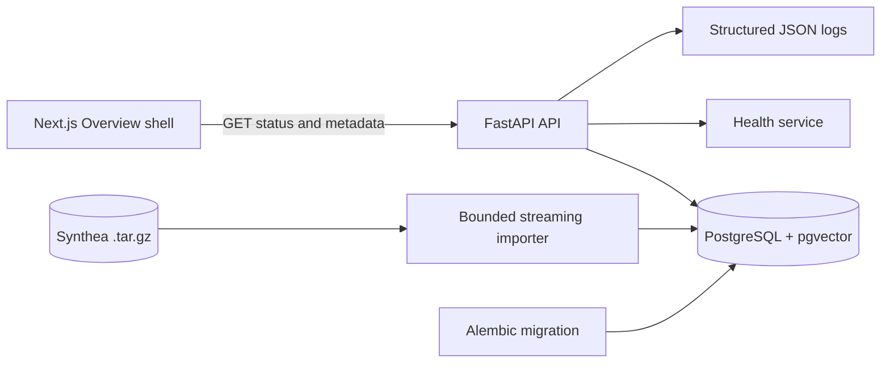
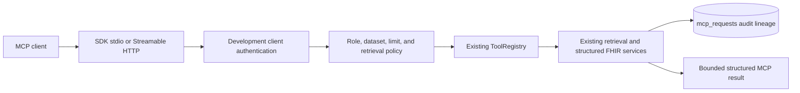
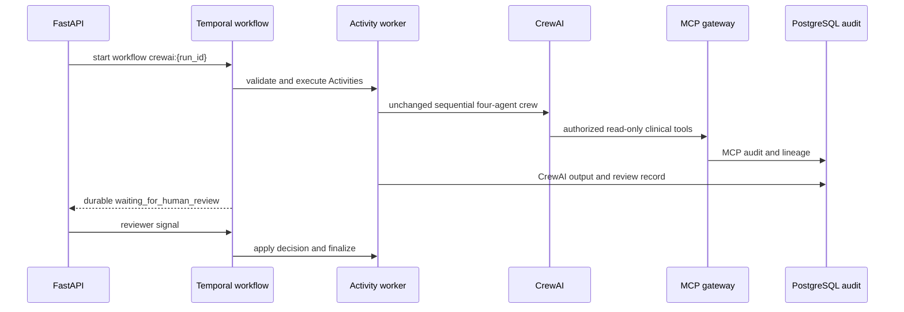

# Architecture

## System context

Researchers will eventually submit natural-language cohort requests over synthetic Synthea data. The platform will plan and trace execution, retrieve candidate records, verify facts against structured FHIR resources, and stop for human approval before export.

## Phase 0 and Phase 1 architecture

Phase 0 contains only the service foundation:

- Next.js App Router frontend with a responsive Overview shell.
- FastAPI backend with typed Pydantic response boundaries.
- SQLAlchemy database connectivity and an Alembic foundation migration.
- PostgreSQL with the pgvector extension available for future retrieval.
- Structured JSON application logging.
- Health, readiness, and platform information endpoints.

Phase 1 adds a streaming archive reader, bounded selected-bundle persistence, normalized FHIR read models, and provenance-preserving dataset APIs. No model is loaded and no agent workflow runs.

## Phase 2 through 2.6 retrieval architecture

Normalized Phase 1 facts feed deterministic encounter documents with title/body representations and tokenizer-aware chunks. Phase 2.5 provides provider isolation: MedCPT uses separate Query and Article encoders with CLS pooling, while BioClinicalBERT remains a mean-pooled comparison encoder. Both use L2-normalized vectors and exact pgvector search; PostgreSQL full-text search is the lexical baseline. Phase 2.6 combines lexical and dense ranks with RRF and optionally reranks a bounded candidate pool with the MedCPT cross-encoder. First-stage ranks/scores and reranker logits remain separately visible. Model loading is lazy, so health endpoints remain available when weights are unavailable. Documents, chunks, and search results retain source-resource lineage. No profile is promoted based on assumptions; the expanded bounded evaluation currently recommends MedCPT for development use, with BioClinicalBERT retained as comparison/fallback and no reranker enabled by default.

## Phase 3A governed LangGraph architecture

Phase 3A adds one persistent `StateGraph` with typed JSON-serializable state: intake → deterministic plan → plan validation → policy precheck → bounded retrieval → structured FHIR verification → evidence validation → policy postcheck → idempotent approval preparation → `interrupt()` → approval/rejection/cancellation → completion. The graph is compiled per invocation with `langgraph-checkpoint-postgres`; application workflow, approval, policy, and lineage tables remain separate institutional audit records.

The deterministic planner accepts explicit criteria and a bounded natural-language vocabulary. It cannot emit SQL, shell, filesystem paths, URLs, or unregistered tools. Retrieval is candidate generation only. Every required criterion is verified against normalized structured FHIR data before approval is requested. Evidence contains criterion status and source FHIR resource IDs, while raw FHIR JSON is not returned in workflow endpoints. Development actor headers simulate identity only; they are not production authentication.

## Phase 3B local planning

The workflow optionally calls `qwen3:8b` through a localhost-only Ollama
`/api/chat` endpoint. Qwen receives the versioned CohortPlan JSON schema and
returns no executable content. Pydantic validation, tool allowlists, dataset
checks, and mandatory approval remain authoritative. If Ollama is disabled,
unavailable, or produces invalid output, the deterministic planner is used and
the fallback reason is recorded. Ollama is an external local process, never a
FastAPI in-process model and never a browser-facing endpoint.

## Future target architecture

The planned vertical slice adds a bounded Synthea importer, normalized FHIR facts, BioClinicalBERT retrieval, and a LangGraph planner/executor workflow. Structured verification remains authoritative over semantic retrieval. Human approval gates cohort export, and lineage records connect agents, prompts, models, tools, data, and decisions.

Deferred integrations include Temporal, Ray, Kubernetes, Helm, and controlled release mechanisms. CrewAI is implemented only as a bounded downstream MCP client; it is not a control plane.

## Phase 5A observability

The local observability path is `API/workers → OTLP → OpenTelemetry Collector
→ Tempo and Prometheus → Grafana`. FastAPI, LangGraph service boundaries,
CrewAI runs, MCP calls, retrieval/model boundaries, and safe database service
operations use low-cardinality spans and metrics. Trace IDs may be persisted
alongside workflow, CrewAI, and MCP audit rows for correlation. Telemetry is
best-effort and redacted; it does not replace append-only audit records or
structured FHIR verification.

## Implemented versus planned

| Capability | Phase 0 status |
| --- | --- |
| Service health and readiness | Implemented |
| Platform metadata API | Implemented |
| PostgreSQL and pgvector foundation | Implemented |
| Bounded Synthea ingestion | Implemented |
| Dataset and patient timeline APIs | Implemented |
| MedCPT dual-encoder retrieval | Implemented (bounded local development) |
| BioClinicalBERT comparison retrieval | Implemented (bounded local development) |
| PostgreSQL full-text baseline | Implemented (bounded local development) |
| LangGraph governed cohort workflow | Implemented (Phase 3A bounded local development) |
| Structured FHIR verification and evidence provenance | Implemented (Phase 3A) |
| Human approval interruption and resume | Implemented (Phase 3A) |
| Local Qwen structured planning with deterministic fallback | Implemented (Phase 3B bounded local development) |
| Workflow Console, Approval Queue, Audit Explorer, Agent Catalog | Implemented (Phase 3B bounded local development) |
| Hosted LLM planning and cohort export | Not implemented |
| MCP gateway | Implemented (Phase 4A) |
| CrewAI downstream oncology research client | Implemented (Phase 4B bounded local development) |
## Phase 3C planner comparison

An administrator configures an allowlist of installed localhost Ollama tags;
workflow requests cannot supply a model name. The comparison runner tests the
same system prompt, strict CohortPlan schema, criterion/tool allowlists,
repair limit, unsafe-request guard, deterministic fallback, and approval
requirement against each tag sequentially. It records Ollama digests and
reported model metadata without persisting cache paths or generated model
artifacts. Safety is a hard gate; quality scores cannot override policy
failures. The measured output is ignored and surfaced through
`/api/v1/planner-policy`; it is synthetic development evaluation only.

## Phase 4A MCP gateway

The separate `apps/mcp_server` process uses the official Python MCP SDK. Its
Streamable HTTP and stdio transports terminate at a validation/authentication
boundary, then call the existing `ToolRegistry`, domain repositories, and
retrieval services. Client identity and dataset access are server-configured;
actor roles cannot be supplied in tool arguments. `mcp_requests` stores safe
application audit metadata separately from LangGraph checkpoints and workflow
tables. MCP records are joined into the existing Audit Explorer response.

MCP is tool-focused only. It does not change the LangGraph topology or expose
workflow finalization, human approval, model selection, raw resources, SQL,
shell, or filesystem capabilities.

## Phase 4B downstream CrewAI client

`apps/crewai_client` is a separate sequential CrewAI application. Its four
agents receive only role-scoped thin tools backed by the official MCP client;
no agent receives database sessions, FHIR repositories, raw resources, model
configuration, or arbitrary network tools. Candidate discovery is followed by
structured evidence collection, provenance review, and a brief writer. The
brief is persisted with MCP request references and stops at
`awaiting_human_review`. Local background execution is bounded to one run and
is not durable across process failure; LangGraph remains the control plane.

## Phase 4C cross-framework governance

The platform exposes a normalized evaluation contract and registry for the
first-party LangGraph workflow and downstream CrewAI MCP client. Shared
synthetic scenarios measure outcome matching, provenance, safety, approval
enforcement, latency, audit completeness, and recovery separately. LangGraph
is selected for durable regulated operations because PostgreSQL checkpoints
and explicit approval transitions are part of its topology. CrewAI is selected
only for bounded downstream specialist collaboration; process interruption is
not equivalent to checkpoint recovery.
## Phase 4D governance hardening

The cross-framework evaluation reuses the unchanged 16 scenarios and keeps
baseline Phase 4C aggregates beside corrected Phase 4D metrics. LangGraph
provenance is validated against persisted workflow evidence. CrewAI evidence
is validated against MCP request lineage and its lifecycle is checked for
ordered start/completion/review events. A framework-specific scorecard
reports independent gates and limitations; it does not declare a universal
winner.

## Phase 5B Temporal durable execution

Temporal coordinates only the downstream CrewAI lifecycle. LangGraph keeps its
PostgreSQL checkpoint topology, while MCP remains the sole governed clinical
access boundary. Temporal Activities call the existing CrewAI and MCP-backed
services; deterministic workflow code performs no database, network, model,
filesystem, or audit side effects.

Temporal retries are bounded and typed. Safety, authorization, dataset, and
governance failures are non-retryable. Recovery is from the last completed
Activity boundary or safe heartbeat, not from a model token position. Legacy
CrewAI execution remains available only with the explicit `legacy` mode.
