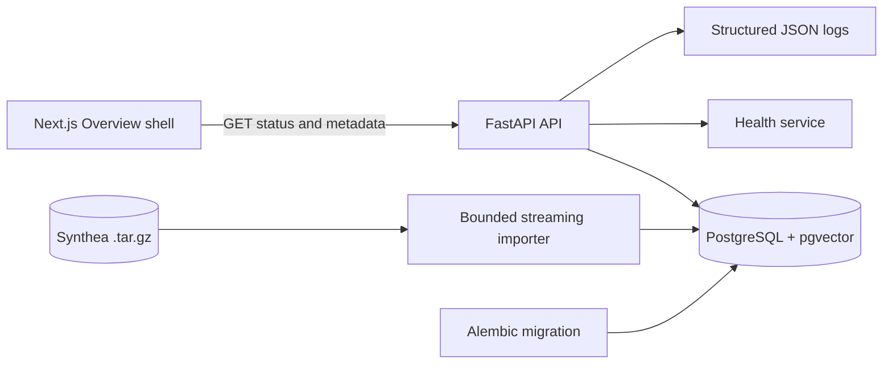

# Architecture

## System context

Researchers will eventually submit natural-language cohort requests over synthetic Synthea data. The platform will plan and trace execution, retrieve candidate records, verify facts against structured FHIR resources, and stop for human approval before export.

## Phase 0 and Phase 1 architecture

Phase 0 contains only the service foundation:

- Next.js App Router frontend with a responsive Overview shell.
- FastAPI backend with typed Pydantic response boundaries.
- SQLAlchemy database connectivity and an Alembic foundation migration.
- PostgreSQL with the pgvector extension available for future retrieval.
- Structured JSON application logging.
- Health, readiness, and platform information endpoints.

Phase 1 adds a streaming archive reader, bounded selected-bundle persistence, normalized FHIR read models, and provenance-preserving dataset APIs. No model is loaded and no agent workflow runs.

## Phase 2 and 2.5 retrieval architecture

Normalized Phase 1 facts feed deterministic encounter documents with title/body representations and tokenizer-aware chunks. Phase 2.5 provides provider isolation: MedCPT uses separate Query and Article encoders with CLS pooling, while BioClinicalBERT remains a mean-pooled comparison encoder. Both use L2-normalized vectors and exact pgvector search; PostgreSQL full-text search is the lexical baseline. Model loading is lazy, so health endpoints remain available when weights are unavailable. Documents, chunks, and search results retain source-resource lineage.

## Future target architecture

The planned vertical slice adds a bounded Synthea importer, normalized FHIR facts, BioClinicalBERT retrieval, and a LangGraph planner/executor workflow. Structured verification remains authoritative over semantic retrieval. Human approval gates cohort export, and lineage records connect agents, prompts, models, tools, data, and decisions.

Deferred integrations include MCP, CrewAI as a downstream client, Temporal, Ray, Kubernetes, Helm, and controlled release mechanisms. They are documented but not runtime dependencies in Phase 0.

## Implemented versus planned

| Capability | Phase 0 status |
| --- | --- |
| Service health and readiness | Implemented |
| Platform metadata API | Implemented |
| PostgreSQL and pgvector foundation | Implemented |
| Bounded Synthea ingestion | Implemented |
| Dataset and patient timeline APIs | Implemented |
| MedCPT dual-encoder retrieval | Implemented (bounded local development) |
| BioClinicalBERT comparison retrieval | Implemented (bounded local development) |
| PostgreSQL full-text baseline | Implemented (bounded local development) |
| LangGraph workflow | Planned |
| Structured FHIR verification | Planned |
| Human approval | Planned |
| MCP/CrewAI interoperability | Planned |
