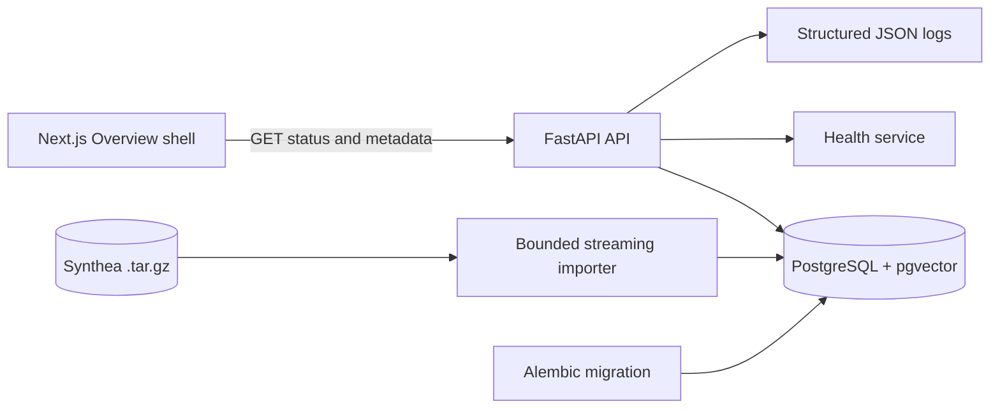

# Architecture

## System context

Researchers will eventually submit natural-language cohort requests over synthetic Synthea data. The platform will plan and trace execution, retrieve candidate records, verify facts against structured FHIR resources, and stop for human approval before export.

## Phase 0 and Phase 1 architecture

Phase 0 contains only the service foundation:

- Next.js App Router frontend with a responsive Overview shell.
- FastAPI backend with typed Pydantic response boundaries.
- SQLAlchemy database connectivity and an Alembic foundation migration.
- PostgreSQL with the pgvector extension available for future retrieval.
- Structured JSON application logging.
- Health, readiness, and platform information endpoints.

Phase 1 adds a streaming archive reader, bounded selected-bundle persistence, normalized FHIR read models, and provenance-preserving dataset APIs. No model is loaded and no agent workflow runs.

## Phase 2 through 2.6 retrieval architecture

Normalized Phase 1 facts feed deterministic encounter documents with title/body representations and tokenizer-aware chunks. Phase 2.5 provides provider isolation: MedCPT uses separate Query and Article encoders with CLS pooling, while BioClinicalBERT remains a mean-pooled comparison encoder. Both use L2-normalized vectors and exact pgvector search; PostgreSQL full-text search is the lexical baseline. Phase 2.6 combines lexical and dense ranks with RRF and optionally reranks a bounded candidate pool with the MedCPT cross-encoder. First-stage ranks/scores and reranker logits remain separately visible. Model loading is lazy, so health endpoints remain available when weights are unavailable. Documents, chunks, and search results retain source-resource lineage. No profile is promoted based on assumptions; the expanded bounded evaluation currently recommends MedCPT for development use, with BioClinicalBERT retained as comparison/fallback and no reranker enabled by default.

## Phase 3A governed LangGraph architecture

Phase 3A adds one persistent `StateGraph` with typed JSON-serializable state: intake → deterministic plan → plan validation → policy precheck → bounded retrieval → structured FHIR verification → evidence validation → policy postcheck → idempotent approval preparation → `interrupt()` → approval/rejection/cancellation → completion. The graph is compiled per invocation with `langgraph-checkpoint-postgres`; application workflow, approval, policy, and lineage tables remain separate institutional audit records.

The deterministic planner accepts explicit criteria and a bounded natural-language vocabulary. It cannot emit SQL, shell, filesystem paths, URLs, or unregistered tools. Retrieval is candidate generation only. Every required criterion is verified against normalized structured FHIR data before approval is requested. Evidence contains criterion status and source FHIR resource IDs, while raw FHIR JSON is not returned in workflow endpoints. Development actor headers simulate identity only; they are not production authentication.

## Phase 3B local planning

The workflow optionally calls `qwen3:8b` through a localhost-only Ollama
`/api/chat` endpoint. Qwen receives the versioned CohortPlan JSON schema and
returns no executable content. Pydantic validation, tool allowlists, dataset
checks, and mandatory approval remain authoritative. If Ollama is disabled,
unavailable, or produces invalid output, the deterministic planner is used and
the fallback reason is recorded. Ollama is an external local process, never a
FastAPI in-process model and never a browser-facing endpoint.

## Future target architecture

The planned vertical slice adds a bounded Synthea importer, normalized FHIR facts, BioClinicalBERT retrieval, and a LangGraph planner/executor workflow. Structured verification remains authoritative over semantic retrieval. Human approval gates cohort export, and lineage records connect agents, prompts, models, tools, data, and decisions.

Deferred integrations include MCP, CrewAI as a downstream client, Temporal, Ray, Kubernetes, Helm, and controlled release mechanisms. They are documented but not runtime dependencies in Phase 0.

## Implemented versus planned

| Capability | Phase 0 status |
| --- | --- |
| Service health and readiness | Implemented |
| Platform metadata API | Implemented |
| PostgreSQL and pgvector foundation | Implemented |
| Bounded Synthea ingestion | Implemented |
| Dataset and patient timeline APIs | Implemented |
| MedCPT dual-encoder retrieval | Implemented (bounded local development) |
| BioClinicalBERT comparison retrieval | Implemented (bounded local development) |
| PostgreSQL full-text baseline | Implemented (bounded local development) |
| LangGraph governed cohort workflow | Implemented (Phase 3A bounded local development) |
| Structured FHIR verification and evidence provenance | Implemented (Phase 3A) |
| Human approval interruption and resume | Implemented (Phase 3A) |
| Local Qwen structured planning with deterministic fallback | Implemented (Phase 3B bounded local development) |
| Workflow Console, Approval Queue, Audit Explorer, Agent Catalog | Implemented (Phase 3B bounded local development) |
| Hosted LLM planning and cohort export | Not implemented |
| MCP/CrewAI interoperability | Planned |
